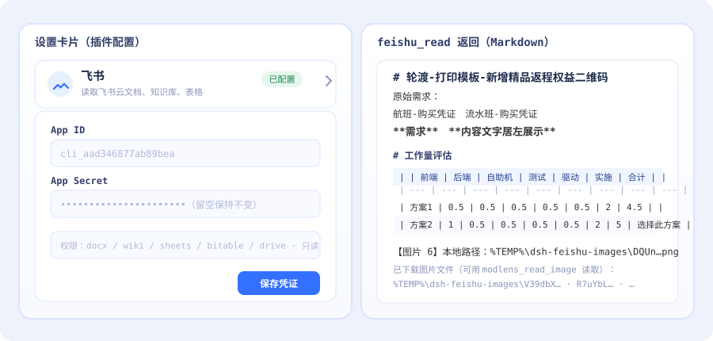
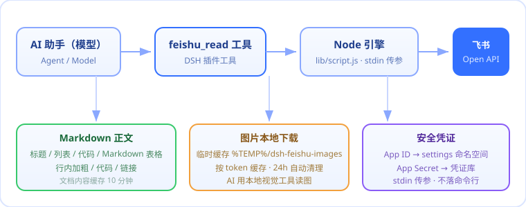

<div align="center">


# 🚢 dsh-feishu-reader

**读取飞书文档 — 文字 / 表格 / 图片，一键转 Markdown 喂给 AI**
<br/>
*Read Feishu (Lark) docs — text, tables & images — as Markdown for your AI*

[](https://github.com/Mr-SYGao/dsh-feishu-reader)
[](LICENSE)
[](package.json)
[](#-开发)
[](https://github.com/Mr-SYGao/dsh-feishu-reader)

</div>

---

## ✨ 特性 / Features

| | 能力 | 说明 |
| --- | --- | --- |
| 📝 | **文字读取** | 云文档 / 知识库 / 电子表格 / 多维表格，保留标题、列表、代码块 |
| 🧾 | **表格还原** | 表格转成真正的 **Markdown 表格**，合并单元格内容不丢 |
| 🖼️ | **图片下载** | 文档里的图片下载到本地，AI 用视觉工具读图 |
| 🎨 | **行内格式** | `**加粗**`、`` `代码` ``、`[链接](url)` 保留 |
| 🔐 | **安全** | 凭证不落命令行、不硬编码 |
| ⚙️ | **设置界面** | 设置里一张卡片，点点就配好 |

## 🖼️ 效果预览 / Preview



## 🚀 安装

> 用 DSH 官方命令或 npm 安装（和 modlens 等插件同款机制）。装完**重启 DSH** 自动加载。

### 方式一 · 官方 `dsh plugin` 命令（包发布到 npm 后）

```bash
dsh plugin --profile desktop add dsh-feishu-reader
```

装完后还需一步（让 DSH 启动时自动加载）：把包名加进 profile 的 `package.json`：

```jsonc
// ~/.dsh/profiles/desktop/package.json
{
  "dependencies": { "dsh-feishu-reader": "^1.0.0" },   // dsh plugin add 已自动加
  "dsh": { "profile": { "bundles": ["dsh-feishu-reader"] } }  // 手动补这一行
}
```

重启 DSH 即生效。发布方操作（只需做一次）：

```bash
cd lib
npm login
npm publish
```

### 方式二 · 本地一键脚本（无需发布 npm，仓库目录执行）

```bash
node scripts/install-local.mjs
# 默认 profile=desktop，换用：--profile=tui
```

脚本自动完成「复制包 → 注册依赖 + bundle → pnpm install」，重启即生效。卸载：`node scripts/uninstall-local.mjs`。

---

## ⚙️ 配置飞书（必需！）

> ⚠️ **不配置就无法使用。** 这个插件通过「飞书开放平台」的接口读文档，需要你自己的飞书应用凭证。

### 1. 创建飞书自建应用

打开 [飞书开放平台](https://open.feishu.cn/app) → 创建**企业自建应用** → 在「凭证与基础信息」拿到：

- **App ID**（`cli_` 开头）
- **App Secret**

### 2. 开通权限（应用 → 权限管理 → 开通并发布）

| 权限 | 用途 |
| --- | --- |
| `docx:document:readonly` | 读取云文档 |
| `wiki:wiki:readonly` | 读取知识库 |
| `sheets:spreadsheet:readonly` | 读取电子表格 |
| `bitable:app:readonly` | 读取多维表格 |
| `drive:drive:readonly` | 下载文档内图片 |

### 3. 授权文档给应用

- 云文档 / 表格：把应用加为文档**协作者**
- 知识库：把应用加入知识库**成员**

### 4. 填入凭证

打开 **设置 → 插件 → 插件配置 → 飞书**，填 App ID / App Secret，点「保存凭证」。

> 也可以让 AI 调用 `feishu_configure(app_id, app_secret)` 配置。

## 🎯 开始使用

把飞书文档链接发给 AI 即可（`/docx/`、`/wiki/`、`/sheets/`、`/base/` 都支持），AI 会读出全文、表格和图片。

## ❓ 常见问题 / FAQ

<details>
<summary><b>图片下载失败？</b></summary>

检查应用是否开通 `drive:drive:readonly` 并发布，且文档已分享给应用。
</details>

<details>
<summary><b>报「缺少飞书凭证」？</b></summary>

按上方[配置飞书](#-配置飞书必需)完成 1-4 步；或调用时直接传 `app_id` / `app_secret`。
</details>

<details>
<summary><b>插件重启后会不会没？</b></summary>

用 `dsh plugin add` 或 `install-local.mjs` 安装（写进 profile）→ 重启自动加载，不会没；会话里临时加载的才会没。
</details>

<details>
<summary><b>合并单元格显示重复内容？</b></summary>

Markdown 无法表达合并，插件把主单元格内容复制到覆盖位置，保证信息不丢（属正常）。
</details>

## 🧠 工作原理 / How It Works



1. AI 调用 `feishu_read(url)` → Host 解析链接类型与文档 token
2. 引擎（`lib/script.js`）通过 **stdin** 接收凭证，调飞书 Open API
3. 文字经 blocks 接口转结构化 Markdown（表格网格重建、行内格式保留）
4. 图片下载到本地临时目录，AI 再用视觉工具读图

## 🛠️ 开发 / Development

```bash
npm run test           # 单元测试（node --test）
npm run check          # 语法检查
npm run build:dynamic  # 从 lib/ 重新生成 host.js / client.js
```

**单一来源**：引擎逻辑只在 [`lib/script.js`](lib/script.js)，动态版由构建脚本生成。

## 📄 License

[MIT](LICENSE) · Made with 🚢 for the DSH / Feishu community
